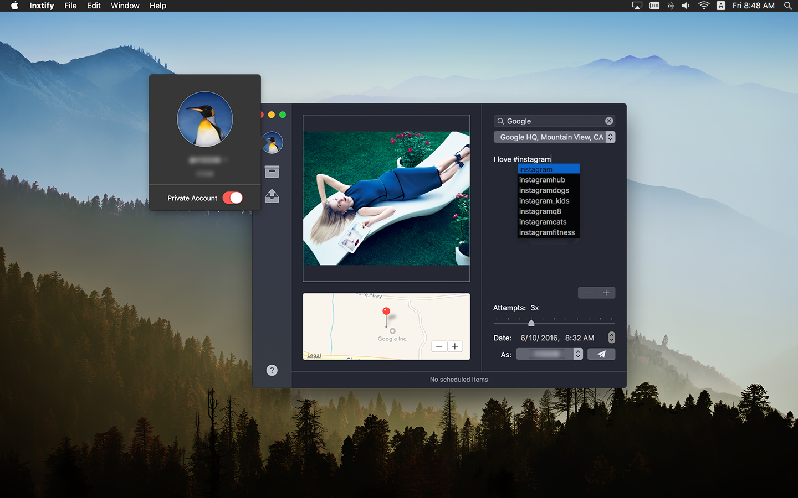

# Inxtify

A native, full-featured Instagram client for macOS.

## Overview

**Inxtify** was a tool I created for macOS back in 2016, which was used by many creatives, artists and marketing specialists for them to take the advantage of advance tools on their macOS such as Photoshop and DSLR images. It was later on shutdown by Apple forcefully without clear details due to Facebook's legal claim. Thus it's not recommanded to use any part regarding this project for any application meant to be sold on Apple's App Store.

This project was modified from its original form for public release, out-of-date and should not be used in any commercial purpose. There'll be no support for this project what-so-ever.

### Requirements

- Xcode 8.3.3 or later.

## License

    Copyright (C) 2016 Zhi-Wei Cai. (@x43x61x69)

    This program is free software: you can redistribute it and/or modify
    it under the terms of the GNU General Public License as published by
    the Free Software Foundation, either version 3 of the License, or
    (at your option) any later version.

    This program is distributed in the hope that it will be useful,
    but WITHOUT ANY WARRANTY; without even the implied warranty of
    MERCHANTABILITY or FITNESS FOR A PARTICULAR PURPOSE.  See the
    GNU General Public License for more details.

    You should have received a copy of the GNU General Public License
    along with this program.  If not, see <http://www.gnu.org/licenses/>.
